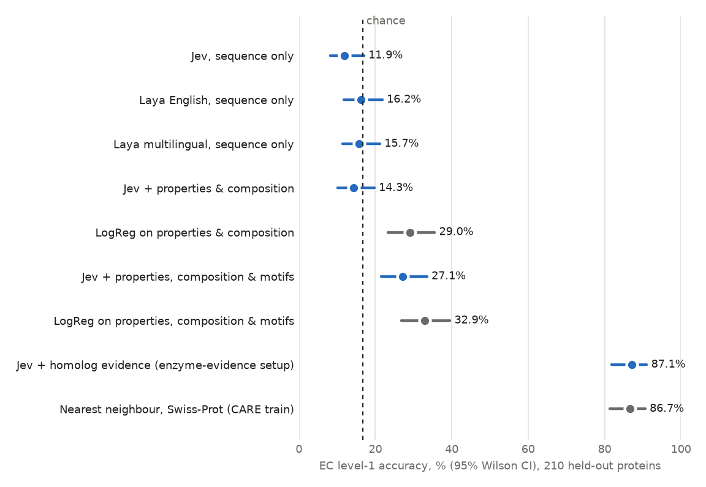
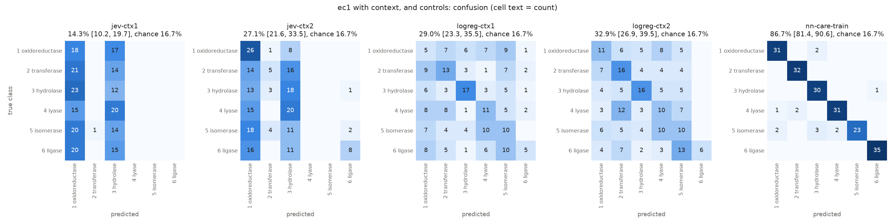

# Enzyme function from raw sequence alone (Jev, Laya)

A sibling of `../enzyme-evidence/`. It shares no code, data or results with it.

**Question.** Can general-purpose decision models (TypeSafe Jev, and the open-weight Laya
checkpoints) classify an enzyme's function from its amino-acid sequence alone, with no
retrieval, homologs, names or annotations?

**Answer (v0.3).**

* **From the raw sequence: no.** On a balanced six-class EC level-1 benchmark (210 held-out
  proteins), none of the three models is above chance (16.7%). Each one collapses onto one or
  two classes regardless of the input, and every model's probabilities have worse log-loss than a
  uniform guess.
* **The sequences do carry the signal.** Nearest neighbour against Swiss-Prot gets **86.7%**, and
  logistic regression on composition and simple properties gets **29.0%**.
* **With context computed from the sequence, Jev improves only when given motifs.** Adding
  properties and composition changes nothing (14.3%). Adding textbook motif matches lifts Jev to
  **27.1%** (+15.2 points over sequence only, p < 10⁻⁶). That is above chance (p < 10⁻⁴) but just
  misses the pre-registered gate, and it is no better than logistic regression on the same
  information (32.9%, difference −5.7 [−12.9, +1.4]). Jev reads the motif descriptions; it
  does not add anything beyond them.
* **Given homolog evidence (the `../enzyme-evidence` setup), Jev matches the nearest
  neighbour again:** 87.1% vs 86.7% at EC level 1, and 60.0% vs 62.4% for the exact EC (both
  differences not significant). The retrieval does the work; Jev adds nothing measurable.
* No model passed the gate on sequence alone, so the harder exact-EC benchmark
  (`benchmarks/ec4.tsv`) was built but **not run**.



## Results: EC level 1 (6 classes × 35 proteins, chance 16.7%)

| Model | Accuracy (95% CI) | p vs chance¹ | Macro-F1 | Log-loss (uniform 1.792) | Brier (uniform 0.833) | Gate |
|---|---|---|---|---|---|---|
| Jev (`jev-1.13.0`, API) | 11.9 (8.2–17.0) | 0.98 | 4.4 | 2.300 | 1.012 | fail |
| Laya English (`convaiinnovations/laya`) | 16.2 (11.8–21.8) | 0.60 | 9.4 | 1.898 | 0.871 | fail |
| Laya multilingual | 15.7 (11.4–21.2) | 0.67 | 5.5 | 2.099 | 0.941 | fail |

¹ One-sided exact binomial test for accuracy above chance. Jev is nominally *below* chance
(two-sided p = 0.064).

Per-class accuracy (recall, %), with how often each class was predicted (of 210):

| True class | Jev | Laya English | Laya multilingual |
|---|---|---|---|
| 1 oxidoreductase | 68.6 | 62.9 | 0.0 |
| 2 transferase | 0.0 | 2.9 | 0.0 |
| 3 hydrolase | 2.9 | 2.9 | 0.0 |
| 4 lyase | 0.0 | 0.0 | 2.9 |
| 5 isomerase | 0.0 | 0.0 | 91.4 |
| 6 ligase | 0.0 | 28.6 | 0.0 |
| *predicted as 1 / 2 / 3 / 4 / 5 / 6* | *167 / 0 / 43 / 0 / 0 / 0* | *134 / 2 / 14 / 0 / 0 / 60* | *0 / 0 / 10 / 5 / 195 / 0* |

The high recall for one class in each model comes from predicting that class for almost every
protein, not from recognising it: precision for that class stays near 1/6. Full confusion
matrices are in `results/ec1/*_confusion.csv`, and per-protein probabilities are in
`results/ec1/*_predictions.csv`.

## Context ladder: EC level 1 (Jev with context, matched controls)

Jev gets the same sequence plus context computed from it. Each level has a matched control:
logistic regression on exactly the same information, trained on pool proteins that share no
30%-identity family with ec1. The plan, motif list and reading were committed before any
context run (`configs/default.yaml`, commit `35e770b`).

| Run | Information | Accuracy (95% CI) | p vs chance | Macro-F1 | Log-loss (uniform 1.792) | Gate |
|---|---|---|---|---|---|---|
| Jev | sequence | 11.9 (8.2–17.0) | 0.98 | 4.4 | 2.300 | fail |
| Jev + level 1 | + length, weight, pI, charge, GRAVY, aromaticity, composition | 14.3 (10.2–19.7) | 0.85 | 7.1 | 2.302 | fail |
| LogReg level 1 | same features | 29.0 (23.3–35.5) | 6×10⁻⁶ | 29.1 | 3.187 | fail |
| Jev + level 2 | + matches to 14 textbook motifs | **27.1** (21.6–33.5) | 9×10⁻⁵ | 20.6 | 3.557 | fail |
| LogReg level 2 | same features + motif indicators | 32.9 (26.9–39.5) | 8×10⁻⁹ | 32.7 | 2.926 | pass |
| Nearest neighbour | best MMseqs2 hit in Swiss-Prot (CARE train, benchmark removed) | 86.7 (81.4–90.6) | <10⁻¹⁰⁰ | 89.6 | 1.582 | pass |

Paired tests on the same 210 proteins (`results/ec1/ladder_tests.json`; exact McNemar, bootstrap CI):

| Comparison | Δ accuracy (points) | 95% CI | Only first right / only second right | p |
|---|---|---|---|---|
| Jev level 1 − LogReg level 1 | −14.8 | −22.4 to −7.1 | 20 / 51 | 0.0003 |
| Jev level 2 − LogReg level 2 | −5.7 | −12.9 to +1.4 | 27 / 39 | 0.18 |
| Jev level 1 − Jev sequence only | +2.4 | −1.9 to +6.7 | 13 / 8 | 0.38 |
| Jev level 2 − Jev sequence only | +15.2 | +10.0 to +21.0 | 37 / 5 | 4×10⁻⁷ |
| Jev level 2 − Jev level 1 | +12.9 | +6.7 to +19.0 | 37 / 10 | 1×10⁻⁴ |

Pre-registered reading: at neither level does Jev "use the context" (pass the gate) or "add to
it" (beat its control). Level 2 comes close to the gate: its lower bound is 21.6% against the
26.7% required.



What the confusion matrices show:

* **Level 1 (numbers):** Jev still collapses, now onto oxidoreductase and hydrolase. It does not
  turn composition or pI into a class; the logistic regression does, weakly (29%).
* **Level 2 (motifs):** Jev starts using clues that name a chemistry. Oxidoreductase recall rises
  to 26/35, ligase to 8/35 and transferase to 5/35, the classes the Rossmann/P450, AMP-binding
  and kinase-loop motifs point to. It still never predicts lyase or isomerase, for which the motif list has
  no clue. Its probabilities are overconfident (mean top probability 0.63, log-loss 3.56).
* Post hoc (not pre-registered): on the 30 proteins with one of the more specific motifs (P-loop,
  HExxH, kinase loop, class I aaRS, P450, thioredoxin, DEAD box, AMP-binding, radical SAM), Jev at
  level 2 is right 50.0% of the time (logistic regression 46.7%). On the other 180 it is right
  23.3% (logistic regression 30.6%).
* **Nearest neighbour** is right for 182 of 210; 15 proteins have no hit. The median identity
  of the top hit is 56%, so most benchmark proteins have close relatives among older Swiss-Prot
  entries, even though no two benchmark proteins share a 30% family.

## Homolog evidence: the enzyme-evidence setup on this benchmark

The same pipeline as `../enzyme-evidence`, re-implemented here (`src/ed/homologs.py`,
`scripts/06_homologs.py`). MMseqs2 searches each benchmark protein against CARE's training set
(Swiss-Prot enzymes) with all benchmark proteins removed, using the same parameters (`-s 7.5`,
e ≤ 10⁻³). The top 10 hits become one candidate per exact EC, and each candidate is shown to Jev
with its ENZYME name, best identity, coverage, rank and support. Jev picks a candidate or "none".
The reading was committed before the run (commit `987ac48`).

| Method | EC level 1 (95% CI) | Exact EC, level 4 (95% CI) |
|---|---|---|
| Nearest neighbour (best hit) | 86.7 (81.4–90.6) | **62.4** (55.7–68.7) |
| Weighted vote over the top 10 | 85.2 (79.8–89.4) | 58.1 (51.3–64.6) |
| **Jev + homolog evidence** | **87.1** (81.9–91.0) | 60.0 (53.3–66.4) |
| Jev + homologs, motif answer when no hit | 88.1 (83.0–91.8) | 60.0 (53.3–66.4) |
| *Oracle: true answer among the candidates* | *88.6* | *65.7* |

Paired tests against the nearest neighbour (exact McNemar, `results/ec1/homologs_report.json`):

| Comparison | Level 1: Δ (only Jev / only NN right), p | Level 4: Δ (only Jev / only NN right), p |
|---|---|---|
| Jev + homologs vs nearest neighbour | +0.5 (2 / 1), p = 1.0 | −2.4 (1 / 6), p = 0.13 |
| Jev + homologs vs weighted vote | +1.9 (4 / 0), p = 0.13 | +1.9 (5 / 1), p = 0.22 |
| Hybrid vs nearest neighbour | +1.4 (4 / 1), p = 0.38 | −2.4 (1 / 6), p = 0.13 |

Pre-registered reading: Jev does **not** add to the homolog evidence.

* **There is little to decide.** 195 of 210 proteins have a hit, but only 97 have more than one
  candidate. Jev picks a different exact EC from the nearest neighbour for 19 proteins (a
  different class for 3). On those, it wins 1 and loses 6 at level 4.
* **The ceiling is close.** At level 1 the true class is among the candidates for 88.6% of
  proteins, and the nearest neighbour already reaches 86.7%. At level 4 the gap is 3.3 points
  (65.7 vs 62.4), and Jev does not close it.
* **Proteins without a hit (15)** cannot be answered from homologs. Falling back to Jev's motif
  answer gets 2 of them right, which is where the hybrid's +1.4 points come from.
* **Same pattern as enzyme-evidence** (Jev 69.1% vs NN 69.5% on the CARE test sets), now
  confirmed on independent, recent Swiss-Prot proteins.

## Design

```
UniProt Swiss-Prot 2026_03, reviewed, not fragment, created >= 2018, 80-600 aa, EC 1-7
  -> exactly one complete EC number, standard residues only, unique sequence
  -> drop anything in a CARE Task 1 test split (30, 30-50, Price, promiscuous) by accession or sequence
  -> MMseqs2 easy-cluster (30% identity, 80% coverage); at most one protein per cluster
  -> ec1: 35 per EC class 1-6 (seeded draw)          -> benchmarks/ec1.tsv (210)
  -> remaining proteins, not sharing a 30% cluster with ec1, re-clustered at 50%;
     every exact EC with >= 10 families (11 ECs), 10 each -> benchmarks/ec4.tsv (110)
prompt: "Protein amino-acid sequence (N residues, one-letter code):\n<sequence>"
        + one choice question (six EC classes with a one-line definition each)
```

* **Sequence only.** The model sees the sequence and its length. It never sees the accession,
  entry or protein name, organism, or any annotation (`tests/test_heldout.py`). The options are
  the same for every protein and are listed in a fixed order.
* **Held out.** No benchmark protein appears in any CARE test set, checked by accession and by
  exact sequence (`tests/test_heldout.py`). CARE's *training* split is not excluded: neither
  model was trained on it, and excluding it too left only 12 EC 6 families among entries created
  since 2020, since CARE already holds almost every Swiss-Prot enzyme created before 2024. Restricting to entries created
  since 2018 lowers the chance that a model saw the sequence together with its label during
  pre-training.
* **Non-redundant.** One protein per 30%-identity family in ec1 (50% in ec4), so correct answers
  cannot come from many near-copies of one easy family. EC 6 limits the class size: only 39
  such families qualify.
* **Laya input length.** Laya's default 512-token window would cut off the end of sequences over
  about 500 residues. Both checkpoints run with `max_len=1024`, and the run fails if any
  input reaches the limit. The largest input was 550 tokens. The English checkpoint was
  trained at 512 tokens, so it is used beyond its training length on 31 of 210 proteins.
* **Pre-registered gate** (`configs/default.yaml`, committed before any benchmark run): a
  model goes on to ec4 only if, on ec1, the lower bound of its 95% Wilson CI exceeds chance
  + 10 points and the one-sided binomial p < 0.001.
* **Pilot.** Three pool proteins that are in neither benchmark were used to check request and
  response formats, before any benchmark call. Prompts were not tuned.
* The benchmarks and EC names (ExPASy ENZYME, release 02-Sep-2026) are committed under
  `benchmarks/`, so later database releases do not change them. `benchmarks/build_log.json`
  records every filtering step.

## Reproduce

```bash
pip install -r requirements.txt
python scripts/01_build_benchmarks.py                      # UniProt + CARE test lists + MMseqs2
python scripts/02_run.py --stage ec1 --model jev           # needs TYPESAFE_API_KEY, ~210 calls
python scripts/02_run.py --stage ec1 --model laya-english  # local, CPU is fine (~1 s/protein)
python scripts/02_run.py --stage ec1 --model laya-multilingual
python scripts/03_evaluate.py --stage ec1
python scripts/02_run.py --stage ec1 --model jev --context 1   # ~210 calls each
python scripts/02_run.py --stage ec1 --model jev --context 2
python scripts/03_evaluate.py --stage ec1
python scripts/04_controls.py                              # logistic regression + nearest neighbour
python scripts/06_homologs.py                              # homolog evidence for Jev (~195 calls)
python scripts/05_compare.py                               # ladder table, paired tests, figures
pytest -q
```

Responses are cached per protein in `results/<stage>/<model>_responses.jsonl`, so reruns
do not call the API again. `02_run.py --stage ec4` refuses to run a model that failed the ec1
gate. Rebuilding the benchmarks against a newer UniProt release gives a different set, so
compare against the committed TSVs.

## Caveats

* **This tests zero-shot use.** Neither model was built for protein sequences: Jev is a hosted
  text decision model, and Laya is a ModernBERT/mmBERT text encoder whose tokenizer splits a
  sequence into arbitrary letter chunks. The result says these models cannot read enzyme
  function off a raw sequence as given. It does not rule out a Laya checkpoint fine-tuned on
  sequences.
* **Small n.** With 210 proteins the 95% CI is about ±5 points, so a gain of a few points over
  chance would go undetected. The observed behaviour (collapse onto one class, log-loss worse
  than uniform) is not a near miss.
* **The logistic-regression controls are weak on EC 6.** Their training pool (2,198 proteins)
  shares no 30% family with ec1, and ec1 already uses nearly every recent EC 6 family, so only
  4 ligases remain for training (67 isomerases). A control trained on a larger pool would
  likely do better, which makes "Jev does not beat its control" a conservative statement. The
  controls' log-loss is worse than uniform for the same reason (class weights fitted to a
  shifted class mix).
* **The motif list is short and hand-written.** It was fixed from textbook biochemistry before
  any context run, and checked only for how often each motif matches pool proteins outside the
  benchmarks. It has no clue for lyases or isomerases. A full PROSITE or Pfam scan would give
  more, but its entry names often state the function outright, which turns the task into
  reading a label.
* **Level 2 includes level 1.** The ladder is cumulative, so level 2's gain is over level 1 and
  over sequence only, not an estimate of motifs alone.
* Option order is fixed (EC 1 to 6). The collapse targets differ between models (oxidoreductase,
  oxidoreductase/ligase, isomerase), so it is not simply a first-option bias.

## Status

| | Status |
|---|---|
| ec1 benchmark, Jev, Laya English, Laya multilingual | done: all at chance |
| ec1 context ladder for Jev (levels 1–2), logistic-regression controls, nearest neighbour | done: Jev reaches 27.1% with motifs, below its control (32.9%) and the gate |
| ec1 with homolog evidence (enzyme-evidence setup) | done: Jev 87.1% (level 1) / 60.0% (level 4), tied with nearest neighbour |
| ec4 benchmark (11 exact ECs × 10, chance 9.1%) | built, **not run**: no model passed the ec1 gate |
