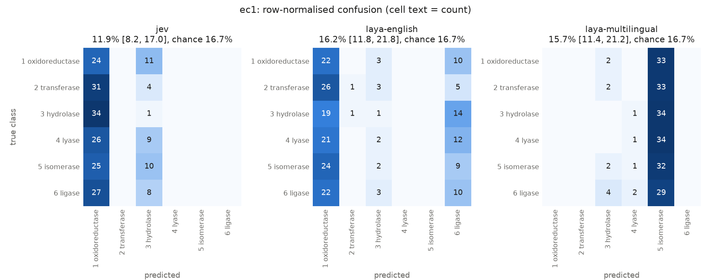

# Enzyme function from raw sequence alone (Jev, Laya)

A sibling of `../enzyme-evidence/`. It shares no code, data or results with it.

**Question.** Can general-purpose decision models (TypeSafe Jev, and the open-weight Laya
checkpoints) classify an enzyme's function from its amino-acid sequence alone, with no
retrieval, homologs, names or annotations?

**Answer (v0.1).** **No.** On a balanced six-class EC level-1 benchmark (210 held-out proteins),
none of the three models is above chance (16.7%). Each one collapses onto one or two classes
regardless of the input, and every model's probabilities have worse log-loss than a uniform
guess. None passes the pre-registered gate, so the harder exact-EC benchmark
(`benchmarks/ec4.tsv`) was built but **not run**.



## Results: EC level 1 (6 classes × 35 proteins, chance 16.7%)

| Model | Accuracy (95% CI) | p vs chance¹ | Macro-F1 | Log-loss (uniform 1.792) | Brier (uniform 0.833) | Gate |
|---|---|---|---|---|---|---|
| Jev (`jev-1.13.0`, API) | 11.9 (8.2–17.0) | 0.98 | 4.4 | 2.300 | 1.012 | fail |
| Laya English (`convaiinnovations/laya`) | 16.2 (11.8–21.8) | 0.60 | 9.4 | 1.898 | 0.871 | fail |
| Laya multilingual | 15.7 (11.4–21.2) | 0.67 | 5.5 | 2.099 | 0.941 | fail |

¹ One-sided exact binomial test for accuracy above chance. Jev is nominally *below* chance
(two-sided p = 0.064).

Per-class accuracy (recall, %), with how often each class was predicted (of 210):

| True class | Jev | Laya English | Laya multilingual |
|---|---|---|---|
| 1 oxidoreductase | 68.6 | 62.9 | 0.0 |
| 2 transferase | 0.0 | 2.9 | 0.0 |
| 3 hydrolase | 2.9 | 2.9 | 0.0 |
| 4 lyase | 0.0 | 0.0 | 2.9 |
| 5 isomerase | 0.0 | 0.0 | 91.4 |
| 6 ligase | 0.0 | 28.6 | 0.0 |
| *predicted as 1 / 2 / 3 / 4 / 5 / 6* | *167 / 0 / 43 / 0 / 0 / 0* | *134 / 2 / 14 / 0 / 0 / 60* | *0 / 0 / 10 / 5 / 195 / 0* |

The high recall for one class in each model comes from predicting that class for almost every
protein, not from recognising it: precision for that class stays near 1/6. Full confusion
matrices are in `results/ec1/*_confusion.csv`, and per-protein probabilities are in
`results/ec1/*_predictions.csv`.

## Design

```
UniProt Swiss-Prot 2026_03, reviewed, not fragment, created >= 2018, 80-600 aa, EC 1-7
  -> exactly one complete EC number, standard residues only, unique sequence
  -> drop anything in a CARE Task 1 test split (30, 30-50, Price, promiscuous) by accession or sequence
  -> MMseqs2 easy-cluster (30% identity, 80% coverage); at most one protein per cluster
  -> ec1: 35 per EC class 1-6 (seeded draw)          -> benchmarks/ec1.tsv (210)
  -> remaining proteins, not sharing a 30% cluster with ec1, re-clustered at 50%;
     every exact EC with >= 10 families (11 ECs), 10 each -> benchmarks/ec4.tsv (110)
prompt: "Protein amino-acid sequence (N residues, one-letter code):\n<sequence>"
        + one choice question (six EC classes with a one-line definition each)
```

* **Sequence only.** The model sees the sequence and its length. It never sees the accession,
  entry or protein name, organism, or any annotation (`tests/test_heldout.py`). The options are
  the same for every protein and are listed in a fixed order.
* **Held out.** No benchmark protein appears in any CARE test set, checked by accession and by
  exact sequence (`tests/test_heldout.py`). CARE's *training* split is not excluded: neither
  model was trained on it, and excluding it too left only 12 EC 6 families among entries created
  since 2020, since CARE already holds almost every Swiss-Prot enzyme created before 2024. Restricting to entries created
  since 2018 lowers the chance that a model saw the sequence together with its label during
  pre-training.
* **Non-redundant.** One protein per 30%-identity family in ec1 (50% in ec4), so correct answers
  cannot come from many near-copies of one easy family. EC 6 limits the class size: only 39
  such families qualify.
* **Laya input length.** Laya's default 512-token window would cut off the end of sequences over
  about 500 residues. Both checkpoints run with `max_len=1024`, and the run fails if any
  input reaches the limit. The largest input was 550 tokens. The English checkpoint was
  trained at 512 tokens, so it is used beyond its training length on 31 of 210 proteins.
* **Pre-registered gate** (`configs/default.yaml`, committed before any benchmark run): a
  model goes on to ec4 only if, on ec1, the lower bound of its 95% Wilson CI exceeds chance
  + 10 points and the one-sided binomial p < 0.001.
* **Pilot.** Three pool proteins that are in neither benchmark were used to check request and
  response formats, before any benchmark call. Prompts were not tuned.
* The benchmarks and EC names (ExPASy ENZYME, release 02-Sep-2026) are committed under
  `benchmarks/`, so later database releases do not change them. `benchmarks/build_log.json`
  records every filtering step.

## Reproduce

```bash
pip install -r requirements.txt
python scripts/01_build_benchmarks.py                      # UniProt + CARE test lists + MMseqs2
python scripts/02_run.py --stage ec1 --model jev           # needs TYPESAFE_API_KEY, ~210 calls
python scripts/02_run.py --stage ec1 --model laya-english  # local, CPU is fine (~1 s/protein)
python scripts/02_run.py --stage ec1 --model laya-multilingual
python scripts/03_evaluate.py --stage ec1
pytest -q
```

Responses are cached per protein in `results/<stage>/<model>_responses.jsonl`, so reruns
do not call the API again. `02_run.py --stage ec4` refuses to run a model that failed the ec1
gate. Rebuilding the benchmarks against a newer UniProt release gives a different set, so
compare against the committed TSVs.

## Caveats

* **This tests zero-shot use.** Neither model was built for protein sequences: Jev is a hosted
  text decision model, and Laya is a ModernBERT/mmBERT text encoder whose tokenizer splits a
  sequence into arbitrary letter chunks. The result says these models cannot read enzyme
  function off a raw sequence as given. It does not rule out a Laya checkpoint fine-tuned on
  sequences.
* **Small n.** With 210 proteins the 95% CI is about ±5 points, so a gain of a few points over
  chance would go undetected. The observed behaviour (collapse onto one class, log-loss worse
  than uniform) is not a near miss.
* **No sequence-based reference.** The comparison is with chance only. A simple sequence model
  (for example amino-acid composition with logistic regression, or nearest neighbour against
  a reference set, as in `../enzyme-evidence/`) would show how much signal the sequences
  carry. The nearest-neighbour approach reaches 62–84% at level 4 on the CARE splits.
* Option order is fixed (EC 1 to 6). The collapse targets differ between models (oxidoreductase,
  oxidoreductase/ligase, isomerase), so it is not simply a first-option bias.

## Status

| | Status |
|---|---|
| ec1 benchmark, Jev, Laya English, Laya multilingual | done: all at chance |
| ec4 benchmark (11 exact ECs × 10, chance 9.1%) | built, **not run**: no model passed the ec1 gate |
