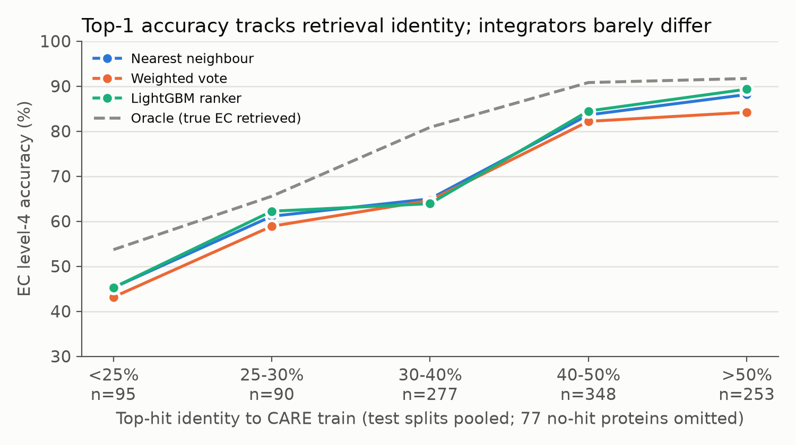
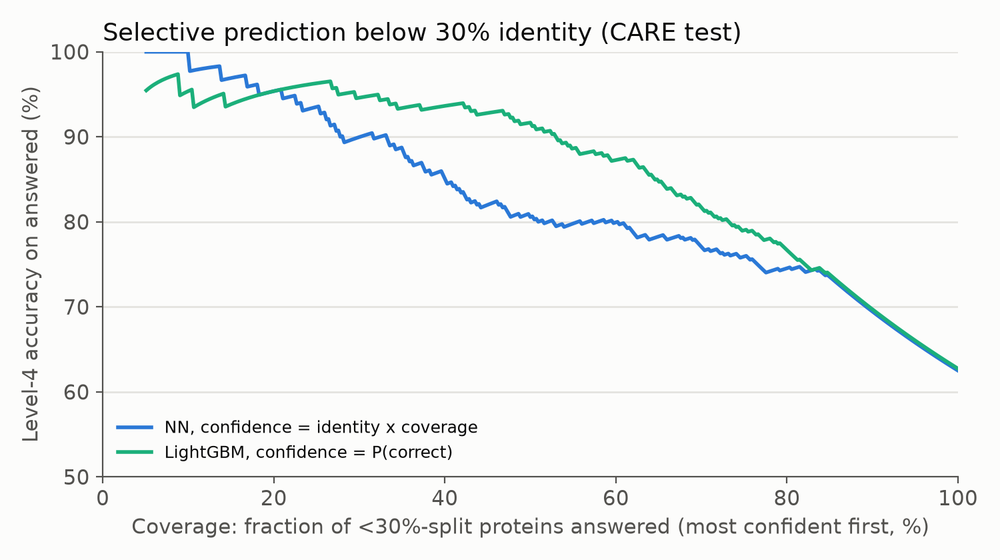

# Evidence integration for enzyme EC classification (CARE Task 1)

**Question.** Given the *same* homologs retrieved only from CARE's training set, does a learned
evidence integrator (a) pick the correct EC more often than the nearest neighbour, and (b) give a
confidence that supports better selective prediction than raw sequence identity, especially below
30% identity?

**Answer (v0.1, frozen config, one test run).**

* **(a) No.** A LightGBM ranker over per-candidate evidence ties the nearest neighbour:
  +0.4 points level-4 accuracy pooled over 1,140 test proteins (95% CI −0.4 to +1.1; 13 wins, 9 losses).
  About 8 points of headroom exist (the true EC is retrieved but not ranked first), and it is not
  recovered from these features.
* **(b) Yes, on the identity splits.** Its P(correct) cuts the area under the risk–coverage
  curve by 20% (<30%) and 55% (30–50%) against thresholding on identity × coverage, and beats every scalar
  confidence tried (identity, bitscore, vote share). At 50% coverage of the <30% split it is right
  on **91.7%** of answered proteins, against 80.6%. It does **not** help on Price, which is out of
  distribution.
* **The retrieval baseline is itself stronger than CARE's published baselines**: MMseqs2 at
  `-s 7.5` reaches 62.5% (<30%) and 83.6% (30–50%) level-4 accuracy, against 51.4% / 81.1%
  for CARE's DIAMOND baseline and 55.1% / 80.2% for CLEAN.

| | Accuracy by identity | Selective prediction, <30% split |
|---|---|---|
| |  |  |

## Results (CARE Task 1 test, level-4 top-1 accuracy, %)

| Split | n | CARE BLAST | CARE best | MMseqs2 NN | Weighted vote | LightGBM | Oracle (EC retrieved) |
|---|---|---|---|---|---|---|---|
| <30% | 432 | 51.4 | 55.1 (CLEAN) | 62.5 | 61.8 | **62.7** | 68.8 |
| <30% strict¹ | 333 | – | – | 56.5 | 55.9 | **56.8** | 62.5 |
| 30–50% | 560 | 81.1 | 81.1 (BLAST) | 83.6 | 83.0 | **84.1** | 89.1 |
| Price | 148 | 35.1 | 41.2 (Foldseek) | **36.5** | 27.0 | **36.5** | 57.8 |

¹ Drops the 99 <30%-split proteins that have a training hit with >30% identity over >80% of their
length: CARE's splits come from MMseqs2 cluster labels, not a pairwise identity guarantee.

Selective prediction (area under the risk–coverage curve, lower is better; paired bootstrap 95% CI
of the difference in `results/test/confidence_analysis.json`):

| Split | NN, identity × coverage | NN, best scalar | LightGBM P(correct) |
|---|---|---|---|
| <30% | 0.168 | 0.168 | **0.134** (Δ −0.034 [−0.059, −0.009]) |
| 30–50% | 0.080 | 0.066 (vote share) | **0.036** (Δ −0.029 [−0.041, −0.003] vs vote share) |
| Price | **0.463** | 0.463 | 0.508 (Δ +0.045 [−0.053, 0.137]) |

## Design

```
CARE protein_train.csv ─► MMseqs2 DB   (the only retrieval database)
queries: dev/fit (CARE-protocol replica from train) + CARE test (<30, 30–50, Price)
  ─► mmseqs search -s 7.5 -e 1e-3 ─► mask (self, identical seq, own 30%/50% cluster)
  ─► top-k hits ─► one row per candidate EC with 19 evidence features
  ─► integrators: nearest neighbour | weighted vote | LightGBM | oracle | Jev (optional)
  ─► CARE-format predictions + CARE-native metrics + paired tests + calibration
```

**Leakage controls** (enforced in `tests/test_leakage.py`):

* Test accessions and sequences are absent from the retrieval DB.
* CARE has no validation split, so a dev set is rebuilt *inside train* with CARE's own recipe:
  single-EC entries alone in their 30% (or 50%, not 30%) cluster whose EC occurs elsewhere, at most
  3 per EC3. Dev and fit queries sit in the DB, so their own hits are masked at the level CARE held
  test proteins out.
* Learned integrators train only on the fit pool; fit queries never see dev entries.
* Everything (k, features) is chosen on dev; `03_tune_dev.py` then sets `frozen: true`, and only then
  will `04_run_test.py` read test labels. The test run recorded its code commit in `results/test/run.json`.
* Decision-model prompts exclude query accession, entry name and sequence (`src/ee/render.py`).
* `tests/test_care_metric.py` checks the scorer reproduces CARE's published BLAST/CLEAN numbers
  exactly from CARE's own result files.

## Reproduce

```bash
pip install -r requirements.txt
bash scripts/00_fetch_care.sh          # CARE at the pinned commit
python scripts/01_build_queries.py     # dev / fit / test query sets
python scripts/02_retrieve.py          # MMseqs2 (auto-downloaded, Linux), ~5 min on 4 cores
python scripts/03_tune_dev.py          # choose k on dev, then freeze the config
python scripts/04_run_test.py          # the single test evaluation
python scripts/05_figures.py
python scripts/07_confidence_analysis.py   # post-hoc confidence baselines (no model changes)
TYPESAFE_API_KEY=... python scripts/06_run_jev.py --role dev   # optional, see below
pytest -q
```

To start again from scratch, set `frozen: false` in `configs/default.yaml`.

## Caveats

* **Small effects are not detectable.** Only about 90 test proteins can be won by re-ranking
  (true EC retrieved, NN wrong). The accuracy result is "no detectable gain", not "no gain".
* **Dev is easier than test** (NN 70.0% vs 62.5% on <30%, 89.0% vs 83.6% on 30–50%): the replica
  is built from what remains in the training set, so it is not a perfect copy of CARE's split.
* **Price is out of distribution** (bacterial proteins from fitness screens, not Swiss-Prot); the
  learned confidence does not transfer there.
* **Swiss-Prot annotations are partly homology-inferred**, so nearest-neighbour agreement is
  partly circular. That affects every method here equally.
* The weighted vote is scored with its vote share and NN with identity × coverage; ECE for NN is
  not meaningful, since that score is not a probability. Compare methods with AURC, which only
  depends on ranking.
* Promiscuous split excluded: only exact duplicates were removed from CARE's training set, so
  near-identical homologs remain.

## Status and next steps

| | Status |
|---|---|
| Retrieval, NN, weighted vote, oracle, LightGBM, evaluation, figures | done |
| Jev zero-shot (`06_run_jev.py`) | implemented, **not run**: needs `TYPESAFE_API_KEY` and access to `api.typesafe.ai`. The response parsing follows the published format but is unverified. |
| Laya fine-tuned on fit-pool contexts | phase 2 (RunPod, about 1–2 h on a 24 GB GPU per run) |
| ESM-2 embedding neighbours as a fallback for the 7% of proteins with no hit | phase 2 |

Given (a), a decision model is only interesting if it beats **LightGBM**, not NN, over the same
evidence, or if it adds evidence the features lack (for example, reasoning over enzyme names).
